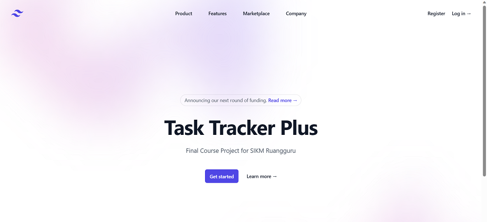

# Task Tracker Plus

A comprehensive task management web application built with Go, featuring a REST API backend and responsive web frontend.



## Overview

Task Tracker Plus is a monolithic web application designed to help users organize and manage their tasks efficiently. The application provides a complete task management system with user authentication, categorization, and a modern web interface.

## Features

### 🔐 User Management
- User registration and authentication
- JWT-based session management
- Secure login/logout functionality

### 📋 Task Management
- Create, read, update, and delete tasks
- Set task priorities and deadlines
- Track task status (In Progress, Completed, etc.)
- View tasks by category

### 🏷️ Category System
- Organize tasks into custom categories
- Full CRUD operations for categories
- Filter tasks by category

### 🌐 Web Interface
- Responsive design with Tailwind CSS
- Landing page with authentication links
- Dashboard for task overview
- Dedicated pages for task and category management

## Technology Stack

- **Backend**: Go (Golang) with Gin framework
- **Database**: PostgreSQL with GORM ORM
- **Frontend**: HTML templates with Tailwind CSS
- **Authentication**: JWT tokens with HTTP cookies
- **Architecture**: MVC pattern with repository layer

## API Endpoints

### Authentication
- `POST /api/v1/user/register` - User registration
- `POST /api/v1/user/login` - User login
- `GET /api/v1/user/tasks` - Get user tasks with categories

### Tasks
- `POST /api/v1/task/add` - Create new task
- `GET /api/v1/task/get/:id` - Get task by ID
- `PUT /api/v1/task/update/:id` - Update task
- `DELETE /api/v1/task/delete/:id` - Delete task
- `GET /api/v1/task/list` - Get all tasks
- `GET /api/v1/task/category/:id` - Get tasks by category

### Categories
- `POST /api/v1/category/add` - Create new category
- `GET /api/v1/category/get/:id` - Get category by ID
- `PUT /api/v1/category/update/:id` - Update category
- `DELETE /api/v1/category/delete/:id` - Delete category
- `GET /api/v1/category/list` - Get all categories

### Web Routes
- `/` - Landing page
- `/client/login` - Login page
- `/client/register` - Registration page
- `/client/dashboard` - User dashboard
- `/client/task` - Task management page
- `/client/category` - Category management page

## Database Schema


The application uses four main tables:

- **users**: Store user account information
- **sessions**: Manage user authentication sessions
- **tasks**: Store task details with priorities and deadlines
- **categories**: Organize tasks into categories

### Relationships
- Users ↔ Sessions (One-to-One)
- Users → Tasks (One-to-Many)
- Categories → Tasks (One-to-Many)

## Project Structure

```
fcp-web-application/
├── api/           # REST API handlers
├── middleware/    # Authentication middleware
├── model/         # Data models and structs
├── repository/    # Database access layer
├── service/       # Business logic layer
├── views/         # HTML templates
├── assets/        # Static assets and images
└── main.go        # Application entry point
```

## Setup and Installation

1. **Prerequisites**
   - Go 1.19 or higher
   - PostgreSQL database
   - Git

2. **Clone the repository**
   ```bash
   git clone <repository-url>
   cd fcp-web-application
   ```

3. **Database Configuration**
   Update database credentials in `main.go` and `main_test.go`:
   ```go
   dbCredentials = Credential{
       Host:         "localhost",
       Username:     "your_username",
       Password:     "your_password", 
       DatabaseName: "your_database",
       Port:         5432,
   }
   ```

4. **Install Dependencies**
   ```bash
   go mod tidy
   ```

5. **Run the Application**
   ```bash
   go run main.go
   ```

6. **Access the Application**
   Open your browser and navigate to `http://localhost:8080`

## Usage

1. **Getting Started**
   - Visit the landing page at `http://localhost:8080`
   - Register a new account or login with existing credentials

2. **Managing Tasks**
   - Create tasks with titles, deadlines, and priorities
   - Organize tasks using categories
   - Update task status as you progress
   - Delete completed or unnecessary tasks

3. **Categories**
   - Create custom categories for better organization
   - View all tasks within a specific category
   - Edit or remove categories as needed

## API Response Examples

### Successful Login
```json
{
  "user_id": 1,
  "message": "login success"
}
```

### Task List
```json
[
  {
    "id": 1,
    "title": "Complete project documentation",
    "deadline": "2023-12-31",
    "priority": 2,
    "category_id": "1",
    "status": "In Progress"
  }
]
```

### Error Response
```json
{
  "error": "invalid task ID"
}
```

## Security Features

- JWT-based authentication
- Password hashing
- Session management
- Protected API endpoints
- Input validation and sanitization

## Contributing

1. Fork the repository
2. Create a feature branch
3. Make your changes
4. Add tests if applicable
5. Submit a pull request

## License

This project is part of a course assignment and is for educational purposes.
